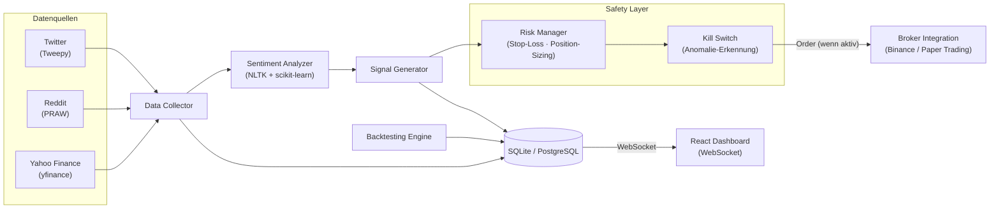

# Automated Trading System

Full-Stack-Anwendung zur automatisierten Handelsstrategie auf Basis von Social-Media-Sentiment. Das System sammelt Daten aus Twitter, Reddit und Yahoo Finance, verarbeitet sie mit NLP/ML-Algorithmen, generiert Trading-Signale und führt Orders über eine Broker-Integration aus — abgesichert durch einen dedizierten Risk-Manager und Kill-Switch.

## Architektur



Der Datenfluss ist **einseitig und pipelineartig**: Rohdaten → Sentiment → Signal → Risiko-Check → Kill-Switch-Gate → Execution. Kein Schritt schreibt zurück in vorgelagerte Layer. Die Architekturentscheidungen hinter dieser Struktur sind in den ADRs dokumentiert.

## Tech Stack

| Layer | Technologie | Warum |
|-------|-------------|-------|
| Backend | Python 3.11, Flask | Synchrone Pipeline passt zu CPU-bound Pandas/NumPy-Workloads — [ADR-002](docs/adr/002-flask-synchron.md) |
| NLP/ML | NLTK, scikit-learn | Etablierte Libraries für Sentiment-Klassifikation ohne DL-Overhead |
| Datenquellen | Tweepy, PRAW, yfinance | Multi-Source für robustere Signale — [ADR-001](docs/adr/001-multi-source-sentiment.md) |
| Broker | ccxt (Binance), Paper Trading | Abstraktionsschicht für Exchange-APIs; Paper Trading für sicheres Testen |
| Safety | Risk Manager + Kill Switch | Dedizierter Safety-Layer — [ADR-003](docs/adr/003-kill-switch-architektur.md) |
| Frontend | React 18, Chart.js, Vite | Standard-Stack für real-time Dashboards mit WebSocket |
| DevOps | Docker, docker-compose, nginx | Reproduzierbare Umgebung, Reverse Proxy für Frontend/Backend |
| Datenbank | SQLite (Dev), PostgreSQL (Prod) | Gleiche SQLAlchemy-Abstraktionsschicht für beide Umgebungen |

## Projektstruktur

```
automated-trading-system/
├── backend/
│   ├── data_collector.py       # Multi-Source Datensammlung
│   ├── sentiment_analyzer.py   # NLP-Pipeline (NLTK + scikit-learn)
│   ├── signal_generator.py     # Signalgenerierung aus Sentiment-Scores
│   ├── risk_manager.py         # Stop-Loss, Position-Sizing, Drawdown-Kontrolle
│   ├── kill_switch.py          # Dedizierter Safety-Layer
│   ├── backtesting_engine.py   # Historische Strategie-Validierung
│   ├── order_manager.py        # Order-Ausführung via ccxt
│   ├── webhook_server.py       # Flask-Server für externe Webhooks
│   ├── security_manager.py     # API-Key-Verschlüsselung, Rate-Limiting
│   └── security_audit.py       # Internes Audit-Skript (selbstgeschrieben)
├── frontend/
│   └── src/
│       ├── components/         # React-Komponenten (Dashboard, Charts)
│       └── services/           # API-Client (Axios + WebSocket)
├── docs/
│   ├── adr/                    # Architecture Decision Records
│   └── TRADING_SYSTEM_DOCUMENTATION.md
├── tests/                      # Pytest-Testsuites
├── docker-compose.yml
├── nginx.conf
└── Dockerfile
```

## Architekturentscheidungen (ADRs)

- [ADR-001 – Multi-Source Sentiment als primäre Signalstrategie](docs/adr/001-multi-source-sentiment.md)
- [ADR-002 – Flask + synchrones Python statt FastAPI](docs/adr/002-flask-synchron.md)
- [ADR-003 – Kill-Switch als dedizierter Safety-Layer](docs/adr/003-kill-switch-architektur.md)

## Backtesting-Ergebnisse

| Metrik | Wert |
|--------|------|
| Anzahl Test-Trades | 240+ |
| Win Rate | 58.3% |
| Profit Factor | 1.42 |
| Sharpe Ratio | 1.87 |
| Max Drawdown | -12.4% |

*Backtesting-Ergebnisse basieren auf historischen Daten und sind kein Indikator für zukünftige Performance.*

## Installation

### Docker (empfohlen)

```bash
git clone https://github.com/tib019/automated-trading-system.git
cd automated-trading-system
cp .env.example .env
# API-Keys in .env eintragen
docker-compose up -d
# Dashboard: http://localhost:3000
```

### Lokal

```bash
# Backend
cd backend && python3 -m venv venv && source venv/bin/activate
pip install -r requirements.txt
python main_simple.py

# Frontend (separates Terminal)
cd frontend && npm install && npm run dev
```

**Erforderliche API-Keys** (in `.env`):

| Variable | Dienst |
|----------|--------|
| `TWITTER_API_KEY` / `_SECRET` | Twitter Developer App |
| `REDDIT_CLIENT_ID` / `_SECRET` | Reddit API |
| `BINANCE_API_KEY` / `_SECRET` | Binance (oder leer lassen für Paper Trading) |

## Sicherheit

Implementierte Maßnahmen: API-Key-Verschlüsselung mit Fernet, Rate-Limiting auf allen Endpunkten, Input-Validierung, Audit-Logging für Transaktionen, automatischer Kill-Switch bei Anomalien. Die Sicherheitsprüfung erfolgt über ein internes Audit-Skript (`backend/security_audit.py`).

## Disclaimer

Dieses Projekt dient ausschließlich zu Bildungs- und Demonstrationszwecken. Kein Finanzrat, keine Gewinngarantie. Live-Trading birgt erhebliche Risiken.

---

**Tobias Buß** · Hamburg · [github.com/tib019](https://github.com/tib019)
